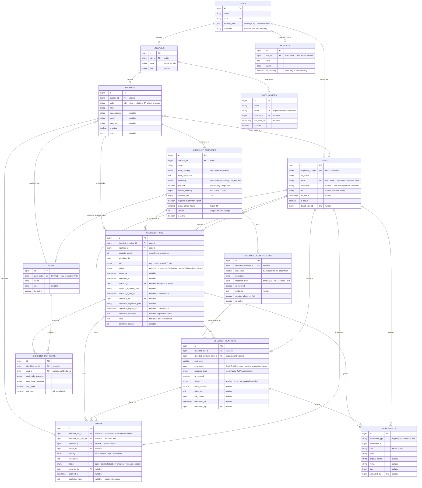
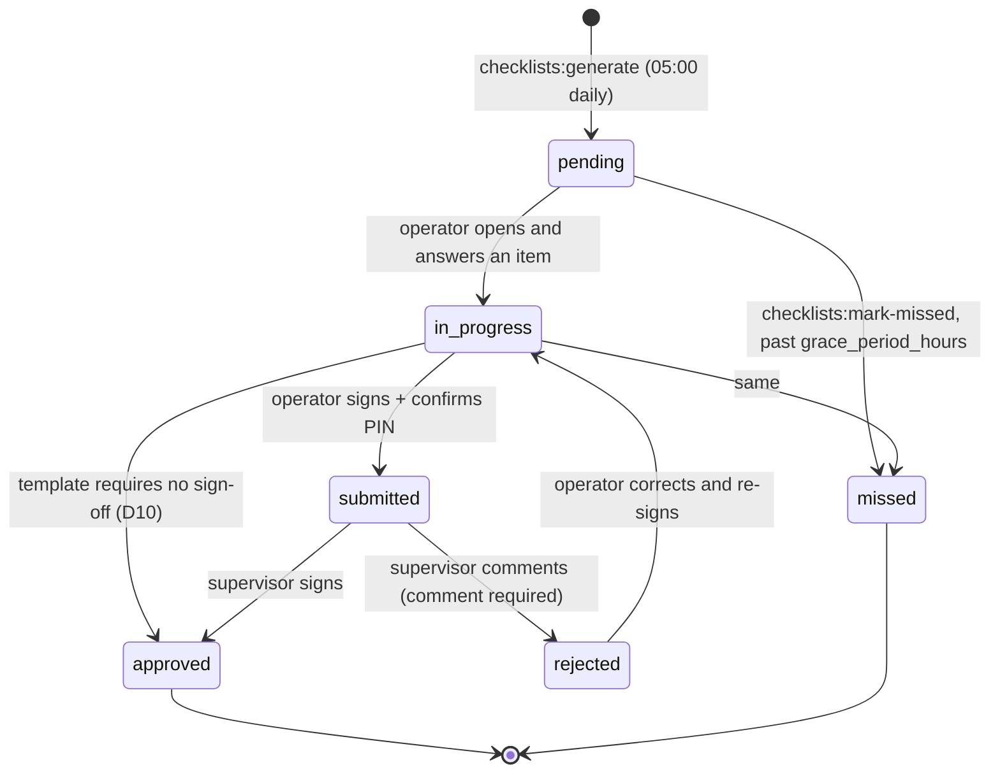
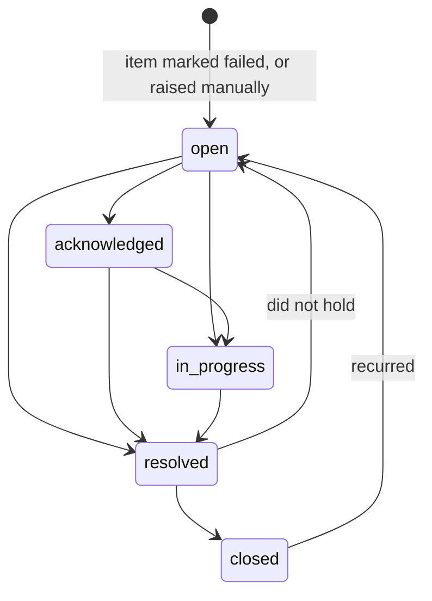

# Data model

The schema of record. `docs/BUILD-CONTRACT.md` §2 is the authoritative
column-by-column list; this document explains the **shape** — what relates to
what, which deletes are blocked, and which columns exist for a reason that is
not obvious from their name.

Charset `utf8mb4`, collation `utf8mb4_unicode_ci`, engine InnoDB. Master data
carries `softDeletes()`. Anything whose removal would orphan a maintenance
record is `restrictOnDelete()` — the database refuses, rather than the
application remembering to check.

---

## Contents

- [Entity relationship diagram](#entity-relationship-diagram)
- [The three layers](#the-three-layers)
- [Delete behaviour](#delete-behaviour)
- [Snapshot columns](#snapshot-columns-and-why-they-exist)
- [The two unique indexes that carry weight](#the-two-unique-indexes-that-carry-weight)
- [Run lifecycle](#run-lifecycle)
- [Issue lifecycle](#issue-lifecycle)
- [Scoping: who sees which rows](#scoping-who-sees-which-rows)
- [Tables not in the diagram](#tables-not-in-the-diagram)

---

## Entity relationship diagram

`ATTACHMENTS` is polymorphic (`attachable_type` + `attachable_id`) and so has no
foreign key. It points at either a `checklist_runs` row (a photo of the whole
job) or a `checklist_run_items` row (evidence for one failed check).

Signature images are **not** attachments. They live in
`checklist_runs.operator_signature_path` / `supervisor_signature_path` on the
disk named by `config('checklists.signature_disk')`, because they are part of
the attestation rather than uploaded evidence, and `App\Support\SignatureImage`
is the only code that writes or deletes them.

---

## The three layers

**Master data** — `sites`, `locations`, `machines`, `parts`, `holidays`, `users`.
Edited by hand, soft-deleted, rarely changes.

**Templates** — `checklist_templates` and its items and parts. One template per
source paper form; 13 seeded. A template is the *question set*, versioned so
that editing it does not rewrite history.

**Transactions** — `checklist_runs` and everything hanging off them, plus
`issues`, `attachments` and `activity_log`. Append-heavy, never hard-deleted.
This is the compliance record.

The direction of travel is one-way: master data feeds templates, templates
generate runs, runs raise issues. Nothing downstream ever writes back upstream.

---

## Delete behaviour

| From | To | On delete | Why |
|---|---|---|---|
| `locations` | `sites` | restrict | A location with no site is unplaceable |
| `machines` | `locations` | restrict | Same |
| `checklist_templates` | `machines` | restrict | A template must belong to a machine |
| `checklist_runs` | `checklist_templates` | **restrict** | Deleting a template would erase the runs it produced |
| `checklist_runs` | `machines` | **restrict** | A run must always name the machine it certifies |
| `issues` | `machines` | **restrict** | Same |
| `checklist_template_items` | `checklist_templates` | cascade | Items have no meaning alone |
| `checklist_run_items` | `checklist_runs` | cascade | Same |
| `checklist_run_parts` | `checklist_runs` | cascade | Same |
| `checklist_run_items` | `checklist_template_items` | **null** | The template item may be retired; the snapshot survives |
| `checklist_run_parts` | `parts` | **null** | Same — `part_name_snapshot` still reads correctly |
| `issues` | `checklist_runs` / `_items` | null | An issue outlives the run that found it |
| anything | `users` | null | People leave; their signed work stays |
| `machine_part`, `user_machine` | either side | cascade | Pure join rows |
| `holidays` | `sites` | cascade | Site-specific holidays go with the site |

The pattern: **cascade for parts of a thing, restrict for the thing itself,
null for the person or definition that produced it.** A user row is never
hard-deleted in practice (soft deletes), but if it were, the runs they signed
would keep the signature image and timestamp — only the link goes.

---

## Snapshot columns, and why they exist

Six columns duplicate data that is available by join. Every one is deliberate.

| Column | Copied from | Because |
|---|---|---|
| `checklist_runs.template_version` | `checklist_templates.version` | Says which edition of the form this run was generated against |
| `checklist_run_items.description` | `checklist_template_items.description` | A run completed in March must display March's wording after the template is reworded in June |
| `checklist_run_items.response_type` | same | An item upgraded from `check` to `numeric` must not retroactively demand a number from a finished run |
| `checklist_run_items.is_required` | same | Making an item required later must not invalidate a run submitted while it was optional |
| `checklist_run_parts.part_code_snapshot` | `parts.part_code` | Parts usage reports under the code it was consumed as |
| `checklist_run_parts.part_name_snapshot` | `parts.name` | A part renamed last month still reports under its old name |

The rule for anyone extending this: **display code must never join a run back to
its template.** If a screen needs a field the run does not carry, snapshot it —
do not add the join.

---

## The two unique indexes that carry weight

### `runs_template_date_shift_unique` — `(checklist_template_id, scheduled_for, shift)`

This, not the application code, is what makes `checklists:generate` idempotent.
Re-running the command at 05:00 and again at 05:05 cannot produce two runs.

`shift` is `NOT NULL` with an explicit `'all'` value rather than nullable
precisely *because* of this index: MySQL does not collide `NULL`s in a unique
index, so a nullable `shift` would have let the generator insert unlimited
duplicate rows — the exact failure the index exists to prevent. This is
deviation D3 in [`seed-notes.md`](seed-notes.md).

### `holidays (site_id, date)`

The same NULL rule bites here and has **not** been solved in the schema.
Site-wide holidays use `site_id = NULL`, so MySQL will not collide them and the
index does not prevent duplicate site-wide holidays. De-duplication is enforced
in application code instead. This is a known limitation, not an oversight —
fixing it in the schema means a sentinel site id, which trades a real foreign
key for a magic number.

---

## Run lifecycle

`RunStatus::isEditable()` is true for `pending`, `in_progress` and `rejected` —
the three states in which the operator still owns the sheet. `approved` runs are
immutable; corrections happen by an admin amendment that is logged, never by
silent edit. `missed` runs are never deleted: they *are* the compliance record,
and a missing row would read as "nothing was due" rather than "this was skipped".

A run's `operator_id` is set to whoever **signs**, not whoever first opened the
sheet (deviation D13) — the signature is the attestation, and the two-person
rule at sign-off must be measured against the person who made it.

---

## Issue lifecycle

Transitions are enforced by `IssueStatus::allowedNext()`, re-read from the
database on every action, so a stale button in a tab left open since the morning
cannot drive a closed issue backwards.

`open`, `acknowledged` and `in_progress` all count as open
(`IssueStatus::openStatuses()`). Resolving requires `resolution_notes`.
Reopening keeps the notes — they are the history of the fault — but clears
`resolved_at`, which is no longer true. Both reopen paths return to `open`
rather than to the previous state: if a repair did not hold, the issue starts
again.

Nothing is ever deleted. An issue is part of the same maintenance record the
checklists are.

---

## Scoping: who sees which rows

`user_machine` is the whole mechanism. An operator is assigned machines;
`App\Models\Scopes\MachineScope` narrows `checklist_runs` and `issues` to those
machines. Supervisors and above are not narrowed.

This matters for exports: CSV and PDF rebuild the identical `ReportFilters`
**including the machine scope**, so an export can never widen what its requester
may see on screen.

Permissions are separate from scope. `report.view` shows numbers on screen;
`export.data` is what takes them out of the building. A supervisor holds the
first and not the second.

---

## Tables not in the diagram

| Table | Source | Purpose |
|---|---|---|
| `activity_log` | `spatie/laravel-activitylog` | The audit trail. Every status change, signature, template edit and item response, with actor, IP and timestamp. The issue history screen renders from this table directly, so the audit trail and the screen cannot drift apart. |
| `roles`, `permissions`, `model_has_roles`, `model_has_permissions`, `role_has_permissions` | `spatie/laravel-permission` | 4 roles, 24 permissions, cumulative grants. See BUILD-CONTRACT §5. |
| `settings` | own | `key` / `value` / `type`. Runtime configuration an admin can change without a deploy. |
| `password_reset_tokens`, `sessions` | Laravel 11 | Unmodified. |
| `cache`, `cache_locks` | Laravel 11 | Cache driver `file` by default; these exist so the database driver is available without a migration. |
| `jobs`, `job_batches`, `failed_jobs` | Laravel 11 | Queue driver `database`. No Redis anywhere. |

---

## Conventions

- **Timestamps** are stored UTC and displayed `America/Port_of_Spain`
  (configurable). Signature timestamps are written on the **server clock** —
  the client never supplies one.
- **Enums** are PHP backed enums in `app/Enums/`, cast on the model, and their
  cases match the MySQL `enum` definitions exactly. Adding a case means a
  migration.
- **Money and quantity** — `qty_used` is `decimal(8,2)`, never a float.
- **`part_code` is a string.** One seeded part code is literally `XXX`. Nothing
  may cast it to an integer.
